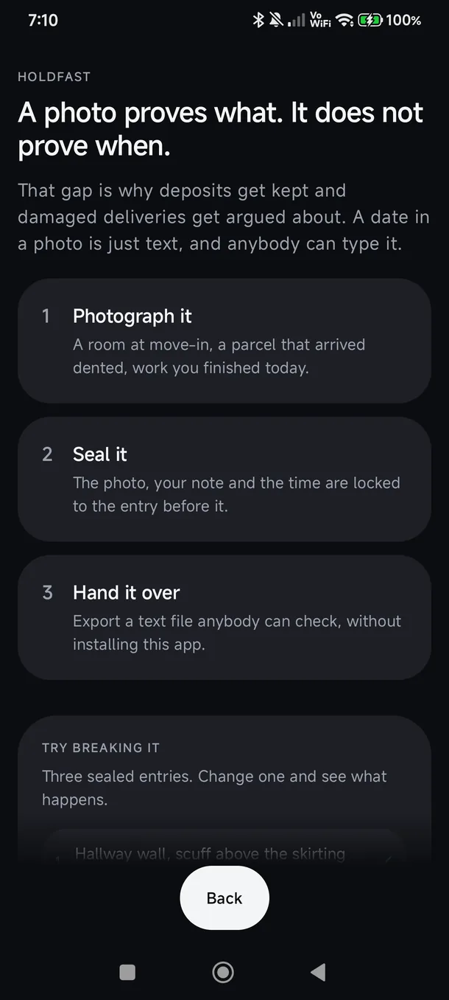
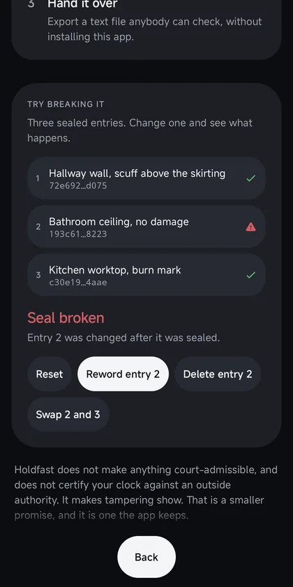
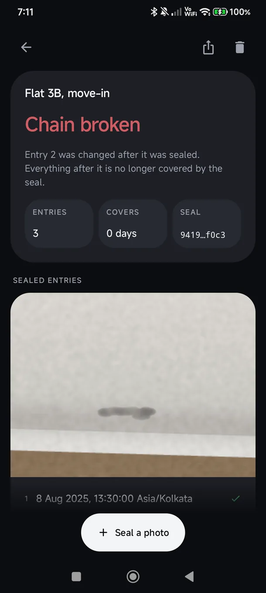
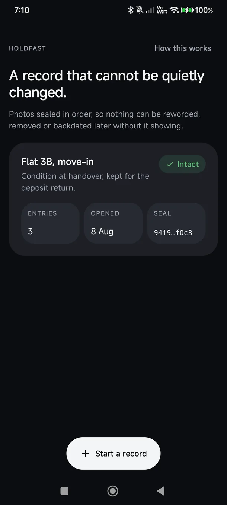
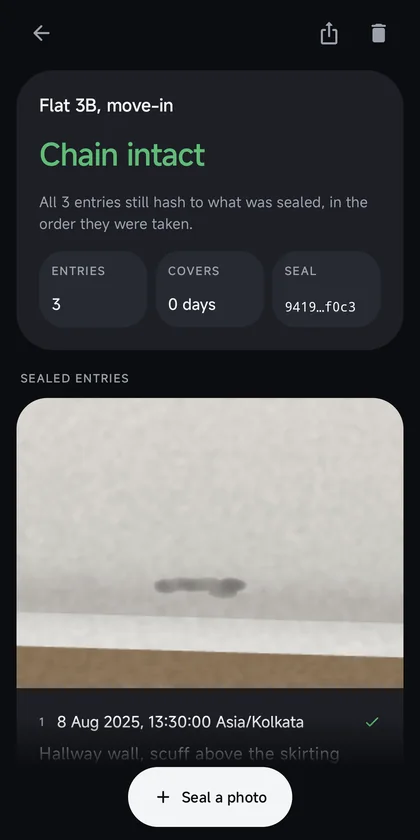
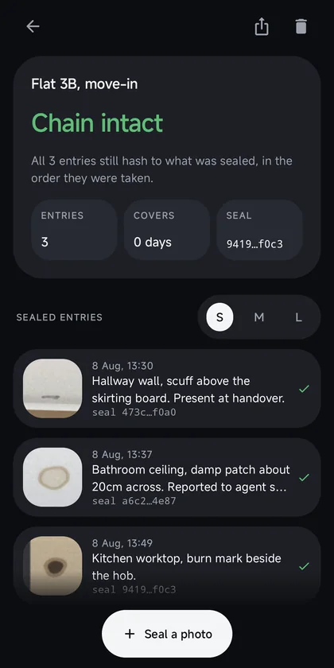

# Holdfast

A record that cannot be quietly changed.

Photograph what you need to prove later. Each photo is sealed to the one before
it, so nothing can be added, removed, reworded or backdated afterwards without
it showing.

[](https://github.com/royalpinto007/Holdfast/actions/workflows/ci.yml)
[](LICENSE)
[](app/build.gradle.kts)
[](#no-internet-permission)

<!-- media:start -->

<p align="center">
  
</p>

<h3 align="center">A record that cannot be quietly changed.</h3>

## Screenshots

<table>
  <tr>
    <td width="33%" valign="top">
      
      <sub><b>The gap it closes.</b> A photo proves what a room looked like, not when.</sub>
    </td>
    <td width="33%" valign="top">
      
      <sub><b>Break it yourself.</b> The verdict comes from the same check your own records go through.</sub>
    </td>
    <td width="33%" valign="top">
      
      <sub><b>Caught.</b> It names the entry, and says what was done to it.</sub>
    </td>
  </tr>
</table>

<details>
<summary><b>Three more</b></summary>

<table>
  <tr>
    <td width="33%" valign="top">
      
      <sub><b>Records.</b> Every one says whether it still holds.</sub>
    </td>
    <td width="33%" valign="top">
      
      <sub><b>Timeline.</b> Each entry carries its time and its seal.</sub>
    </td>
    <td width="33%" valign="top">
      
      <sub><b>Sizes.</b> Small skims a long record. The seal never shrinks away.</sub>
    </td>
  </tr>
</table>

</details>

<sub>Captured from the app running on a physical device, with the status and
navigation bars cropped out. The photos in the sample record are drawn rather
than photographed, so this repository carries no pictures of anybody's home.</sub>

<!-- media:end -->

## The problem

You move into a flat and photograph the damp patch. Eleven months later the
landlord keeps £600 of the deposit for it. You still have the photo. It changes
nothing, because a photo proves what a room looked like, not when.

Every "timestamped camera" app answers this by burning the date into the pixels.
That is a caption. Anyone can type any date into any image, and the person on the
other side of the dispute knows it.

## Why not just a photo gallery?

Fair question, and the honest answer has a limit in it.

A gallery holds the photos, and it can show you a date. What it cannot do is
tell anyone that the **set** is the same set as before. You can delete the
photo that hurts your case, add one taken last week, or edit the EXIF date in
about four seconds with a free tool. None of that leaves a mark, which is
exactly why the other side of a dispute does not have to take your gallery
seriously.

Holdfast links the entries to each other. Change any one of them and the link
to the next one stops matching, and the app names the entry where it happened.

**The limit worth stating plainly:** this does not stop somebody fabricating a
record from scratch. You hold the phone and the file, so you could build any
chain you like. What it stops is a record being changed *after somebody else
has seen it*. The moment you export the record, or just send the head hash to
the letting agent, the insurer, or your own email, that hash pins everything
behind it. Any later edit has to disagree with the copy they already have.

So the useful habit is to hand over the export early, not at the point where
you need it. A seal is only worth anything once somebody else has a copy of it.

## What Holdfast does instead

Each entry hashes its photo, its note and its time together with **the hash of
the entry before it**. That makes the record a chain:

- reword a note → its hash changes → every entry after it stops following
- delete an entry → the next one no longer follows
- reorder two → both stop following
- insert one later → the entry after it no longer follows
- swap the photo file → the sealed photo hash no longer matches the bytes
- backdate an entry → it is dated before the one it follows, and is rejected

You cannot quietly repair any of that, because repairing it means recomputing a
chain you have already exported to somebody else.

**It does not make anything court-admissible, and the app never says it does.**
It makes tampering detectable. That is a smaller and honest promise.

## Try it before trusting it

Open the app and there is a sample record with three sealed entries, and
buttons that tamper with it: reword one, delete one, swap two. The verdict
underneath is produced by the same `verify()` that runs on your own records,
not by a script that prints a canned answer.

It is reachable any time from **How this works** on the home screen, because a
claim like this one is worth checking twice.

## Photo sizes

A record with twenty entries is a long scroll when you are hunting for the one
from the kitchen. **S**, **M** and **L** above the entry list change how the
photos are drawn, and the choice is remembered.

Small becomes a scannable list with a thumbnail per row. What never shrinks
away is the seal line and the tick, because making the photos smaller must
never be a way of accidentally hiding whether the entry still checks out.

## No internet permission

Not "we don't upload", not "we anonymise". `AndroidManifest.xml` declares no
`INTERNET` permission, so the app is incapable of making a network request:
no sync, no backup, no crash reporting.

There is no `CAMERA` permission either. Photos come from the system camera,
which hands back one image and nothing else. Cloud backup and device transfer
are both switched off, so cases do not leave through Android either.

CI fails the build if any of that changes.

## Exports are checkable without the app

An export is a plain text file that states the hashing rule at the top and
prints every hash in full. Someone who does not have Holdfast can recompute the
chain with `sha256sum` and a text editor. A seal only anybody with the app can
verify is a logo, not a seal.

## Install

Not on Google Play yet. Build it, or grab an APK from
[Releases](https://github.com/royalpinto007/Holdfast/releases) when one is cut.

```bash
git clone https://github.com/royalpinto007/Holdfast.git
cd Holdfast
./gradlew :app:assembleDebug
adb install -r app/build/outputs/apk/debug/app-debug.apk
```

## Use

1. **Start a record.** Give it a title and a line on why you are keeping it.
2. **Seal a photo.** The system camera opens, you add a note and optionally a
   place, and the entry is sealed to the one before it.
3. **Hand it over.** The share button writes a plain text export. Send it to
   the other party, or to yourself, on the day you make it rather than the day
   you need it.

## Build

```bash
./gradlew :app:assembleDebug
./gradlew :app:testDebugUnitTest
./scripts/check-privacy-claims.sh
```

Kotlin, Jetpack Compose, Material 3. One module, no backend, no dependencies
beyond AndroidX, Compose and kotlinx-serialization.

## Where the logic lives

- **`Chain.kt`** is the whole product claim: sealing, and `verify()`. It is pure
  Kotlin with no Android imports, which is why it can be tested exhaustively.
- **`Vault.kt`** is storage and export. JSON on disk, deliberately readable.
- **`Design.kt`** is the design system: depth as hierarchy, bento tiles, one
  signal green and one break red and nothing else.

The tests are almost entirely about tampering: each of the six ways a record can
be doctored has a test that proves it is caught, plus one that pins the field
separator after a real bug where it was an invisible NUL typed into the source.

## Licence

MIT. See [LICENSE](LICENSE).
